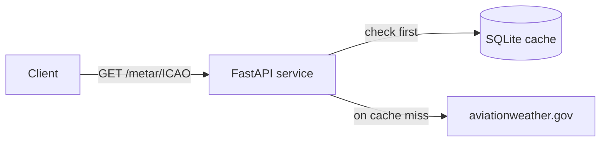

# AeroBrief architecture

```mermaid
flowchart LR
    Client -->|GET /metar/ICAO| API[FastAPI service]
    API -->|check first| Cache[(SQLite cache)]
    API -->|on cache miss| AWC[aviationweather.gov]
```