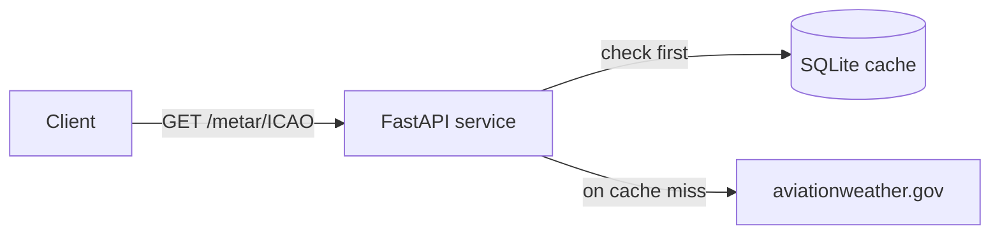
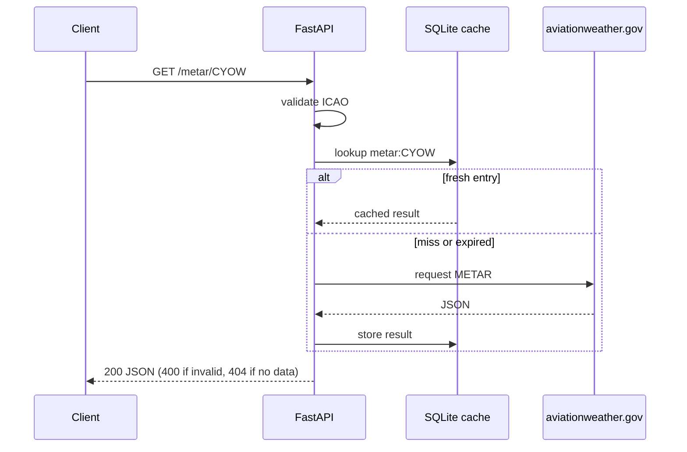

# AeroBrief architecture

```mermaid
flowchart LR
    Client -->|GET /metar/ICAO| API[FastAPI service]
    API -->|check first| Cache[(SQLite cache)]
    API -->|on cache miss| AWC[aviationweather.gov]
```

## Request sequence

```mermaid
sequenceDiagram
    participant C as Client
    participant A as FastAPI
    participant D as SQLite cache
    participant W as aviationweather.gov
    C->>A: GET /metar/CYOW
    A->>A: validate ICAO
    A->>D: lookup metar:CYOW
    alt fresh entry
        D-->>A: cached result
    else miss or expired
        A->>W: request METAR
        W-->>A: JSON
        A->>D: store result
    end
    A-->>C: 200 JSON (400 if invalid, 404 if no data)
```